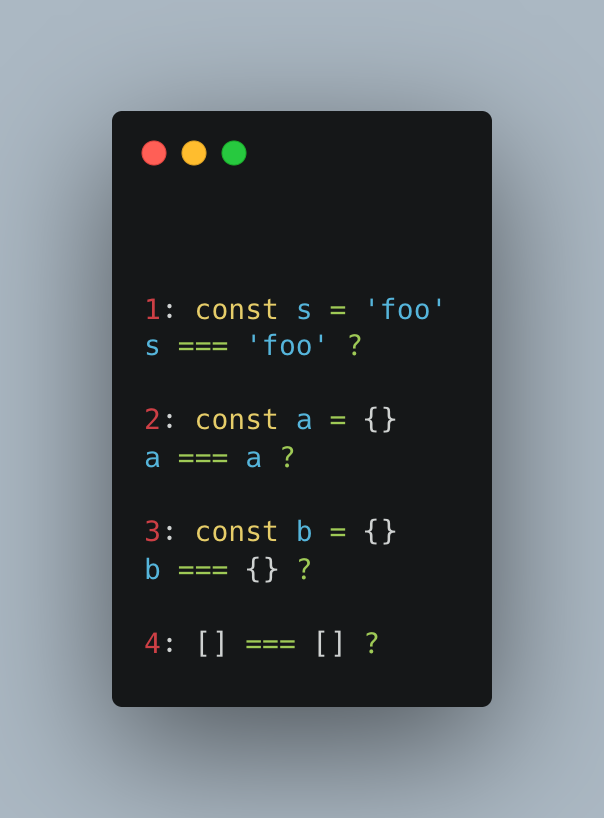

# Questionnaire

- [Questionnaire](#questionnaire)
  - [What is == vs === and when should you use each?](#what-is--vs--and-when-should-you-use-each)
  - [What is the difference between let, const and var - pros and cons of using each one](#what-is-the-difference-between-let-const-and-var---pros-and-cons-of-using-each-one)
    - [`var`](#var)
    - [`let`](#let)
    - [`const`](#const)
  - [What is the output of each?](#what-is-the-output-of-each)
  - [What are closures in JS?](#what-are-closures-in-js)
  - [What is a Promise, and how does it relate to async/await?](#what-is-a-promise-and-how-does-it-relate-to-asyncawait)
  - [What does the spread operator (...) do in JS?](#what-does-the-spread-operator--do-in-js)
  - [What are the implications of Objects and Arrays being assign-by-reference in JS?](#what-are-the-implications-of-objects-and-arrays-being-assign-by-reference-in-js)
  - [Given array [5,6,7,24,24,109,5,13,0,3,1] using JavaScript remove the duplicate values and sort in ascending order](#given-array-5672424109513031-using-javascript-remove-the-duplicate-values-and-sort-in-ascending-order)

## What is == vs === and when should you use each?

Both are equality comparison operators, but the `==` makes a comparison regardless of the type of the value. For example, if you want to compare a string `"10"` and a number `10` the result is going to be `true` because after the comparison the operator does an automatic `type coercion` to transform both values to the same type. There are many rules and conditions that JavaScript takes into account to do that type transformation, but instead of learning all of them, it is simpler to use the `===` operator (the strict equality operator).

The strict equality operator compares two values also taking into consideration their types, so that if we wanted to compare `"10" === 10` we would have a log of `false` value instead of a `true` because the types don’t match.

```jsx
// Comparison operator
console.log("10" == 10); // -> true

// Strict comparison operator
console.log("10" === 10); // -> false
```

As a good practice, you should always use the `===` because it will save you a lot of trouble in terms of comparing variables with different types that need to be transformed to compare successfully. Regardless of this situation, if you need to compare two variables with different types, there are many built-in methods that can help you transform the data types to be compared.

## What is the difference between let, const and var - pros and cons of using each one

### `var`

It can be used to declare a variable in the global scope (due to the nature of its pre-initialization before the evaluation of its initializer) or to declare a local variable within a function.

The `var` keyword allows hoisting, which means that you can declare it anywhere in your code and the variables will be "lifted" to the top of the scope during the creation phase.

**Pros**: if you want to declare your variables anywhere in the code without worrying about the code hierarchy, or overwrite some previous variables by using a new initialization of a variable with the same name.

**Cons**: the `var` keyword can make variable management a bit difficult to maintain. There might be a possibility of overwriting two variables with the same name if both are declared in the same scope.

```jsx
// The randomVariable is being hoisted to the top of to code,
// that's why we are not getting a ReferenceError
console.log(randomVariable); // -> undefined
var randomVariable = "Just a placeholder";
console.log(randomVariable); // -> "Just a placeholder"

// Function scope
function getRandomDestination() {
  var destinations = ["Buenos Aires", "Cancún", "Tokyo"];
  var randomIndex = Math.floor(Math.random() * destinations.length);

  return destinations[randomIndex];
}

// Trying to log the destinations array inside the destination function
console.log(destinations); // -> Will throw a ReferenceError
console.log(getRandomDestination()); // -> "Tokyo"
```

### `let`

With the introduction of the ES6 standard, the keyword `let` was created. This variable declaration has a `block scope`, which means that the data that has been stored within its initialization will only be accessible from: code belonging to the same lexical environment within the corresponding `code block` and nested code through the `scope chain`. In addition, this type of variable declaration is not hoisted.

**Pro**: It keeps you safe from overwriting a variable in a different scope that shares the same name because it has a block scope.

**Cons**: the code can be a bit difficult to follow if you use the same variable over and over again by reassigning it with new data.

```jsx
function getRandomDestination() {
  const destinations = ["Berlin", "Bali", "Nepal"];
  const randomIndex = Math.floor(Math.random() * destinations.length);
  const selectedDestination = destinations[randomIndex];

  if (["Nepal", "Bali"].includes(selectedDestination)) {
    //The variable greetings cannot be accessed from outside this `if` code block.
    // If we had declared it with the `var` keyword, we could get this variable
    // from outside this block.
    let greetings = {
      nepal: "शुभ यात्रा!",
      bali: "Semoga perjalananmu menyenangkan!",
    };

    // Personalized greeting only if traveling to an Asian country
    console.log(greetings[selectedDestination.toLowerCase()]);
  }

  // The log below is going to throw a ReferenceError because the greetings
  // variable is only accessible within its code block. If we had used `var`,
  // we would have gotten the value without any problems.
  // console.log(greetings); -> ReferenceError

  return selectedDestination;
}

console.log(getRandomDestination());
```

### `const`

Similar to the `let` keyword, a variable declared using this logic has a block scope, and it can’t be reassigned.

**Pro**: it can help you develop cleaner code since you can restrict the value of the variable under a single name, avoiding potential confusion and side effects if you reassign that variable with a completely different value later in your code.

**Cons**: you can’t reassign the value of the variable once initialized.

```jsx
let destination = "Peru";
const price = 2195;

destination = "Colombia";
price = 2375; // TypeError: "price" is read-only
```

## What is the output of each?



```jsx
const s = "foo";
console.log(s === "foo"); // -> true. Both values are the same primitive string.

const a = {};
console.log(a === a); // -> true. Both values shares the same pointer to the memory heap
// that points to the same object.

const b = {};
console.log(b === {}); // -> false. After their creation, both values were assigned with a
// different reference within the heap.Thus, even if both are two identical
// objects in their structure, the operator will compare only the reference
// of each one.It would not be doing a deep comparison.

console.log([] === []); // -> false. Happens the same as in the previous comparison.
```

## What are closures in JS?

A closure is generated when we instantiate a function that returns a function, and that second one "remembers" and can use the values declared in its parent scope by accessing the reference created through the lexical environment.

Every time we create a function, we are creating an execution context with a local lexical environment. It is within that lexical environment where all the variables and their corresponding values are stored. Thus, if we create a function inside another function, what we are creating are 2 different lexical environments.

We can take advantage of this behavior since it opens the possibility to create a function that holds a “private local state”; which is no more than the variables created in an upper scope and binded using a reference to memory pointing to the upper lexical environment.

We can take advantage of this behavior, as it opens the possibility of creating a function that keeps a "private local state"; which is nothing more than the variables created in a higher scope and linked by a memory reference pointing to the upper scope lexical environment.

```jsx
// We can create the spot manager to manage the available
// spots in a trip.

const spotManager = (destination) => {
  const selectedDestination = destination;
  let spots = 15;

  // Below we are using the "module pattern" to create methods
  // to help us read and manipulate the variables in the upper
  // scope, since they will be unreachable after the instantiation.
  return {
    getSpots() {
      return spots;
    },
    getDestination() {
      return selectedDestination;
    },
    buySpot() {
      spots--;
    },
  };
};

const manager = spotManager("Buenos Aires");
// After the initialization of the manager variable with the
// argument of "Buenos Aires". We are going to have a manager
// that stores the destination and manages the "spot buying" functionality.

console.log(manager.getDestination()); // -> "Buenos Aires"
console.log(`There are ${manager.getSpots()} spots left.`);
// -> There are 15 spots left.

manager.buySpot();
manager.buySpot();
manager.buySpot();

console.log(`There are ${manager.getSpots()} spots left.`);
// -> There are 12 spots left.
```

## What is a Promise, and how does it relate to async/await?

A promise is an object that can return 3 types of values (a pending value or one after its successful (fulfilled) or failed (rejected) completion). It is normally used to handle asynchronous operations and, after being triggered, it is sent to be handled by the browser's `web workers`. When the process completes (either successfully or unsuccessfully), the result is sent to the `micro tasks queue`, and waits for the `call stack` to be empty to execute its logic.

```jsx
const checkTripAvailability = () => {
  return new Promise((resolve, reject) => {
    // Simple code snippet to randomly decide if the trip
    // is available or not.
    const isAvailable = Math.random() >= 0.5;
    console.log("Checking availability...");

    if (isAvailable) {
      setTimeout(() => resolve("The trip is available"), 1000);
    } else {
      const error = new Error("Sorry, the trip is not available");
      setTimeout(() => reject(error), 1000);
    }
  });
};

checkTripAvailability()
  .then((result) => console.log(result))
  .catch((error) => console.error(error))
  .finally(() => console.log("End of the trip availability check"));
```

The async/await was introduced in the ES6 version of JavaScript. These new features allow the creation of async functions that let you use the await functionality to stop code execution until the promise is resolved and catch the error if necessary.

```jsx
const checkTripAvailability = () => {
  return new Promise((resolve, reject) => {
    // Simple code snippet to randomly decide if the trip
    // is available or not.
    const isAvailable = Math.random() >= 0.5;
    console.log("Checking availability...");

    if (isAvailable) {
      setTimeout(() => resolve("The trip is available"), 1000);
    } else {
      const error = new Error("Sorry, the trip is not available");
      setTimeout(() => reject(error), 1000);
    }
  });
};

// In this example it is always recommended to wrap the code functionality
// inside a try/catch block to ensure the handling of errors.
const isTripAvailable = async () => {
  try {
    const availability = await checkTripAvailability();
    console.log(availability);
  } catch (error) {
    console.error(error);
  } finally {
    console.log("End of the trip availability check");
  }
};

isTripAvailable();
```

## What does the spread operator (...) do in JS?

The spread operator copies the value of a specific object and pastes it into a new object. The remaining object is a brand-new object with a different pointer to memory.

```jsx
// You can use the spread operator to copy and paste
// values from one array to another.
const array = ["Paris", "London"];
const newArray = ["Croatia", ...array];

// You can also use it to copy and paste properties from
// an object to another.
const trip = {
  destination: "Europe",
  name: "Italy with Mina Marlena",
  price: 3095,
};
const tripWithCategory = { ...trip, category: "Photography" };

// And we can even determine the presence or absence of a
// property in an object using this pattern.
const addTravelerInsurance = false;
const tripSummary = {
  categories: ["Adventure"],
  destination: "Europe",
  id: "61fbfb856a7d4600511b9d77",
  maximumSpots: 18,
  minimumTripThreshold: 8,
  name: "Croatia with Radhika Patel",
  onHoldTravelers: 0,
  pendingTravelers: 1,
  price: 2250,
  ...(addTravelerInsurance && {
    travelerInsurance: {
      insuranceCoverageLevel: "high",
      coverAmount: 4500,
    },
  }),
};
```

## What are the implications of Objects and Arrays being assign-by-reference in JS?

In every JavaScript script, the `call stack` is responsible for linearly executing the JavaScript program. When a variable is declared and initialized with a primitive value, it stores that value in its local execution context defined by its scope. But primitive values are immutable and this is not the case for literal objects `{ }` and arrays `[ ]`, these work differently, as they have a mutable nature.

When we create an object, we are able to edit its properties (mutate them), extending or truncating parts of it. That's why the JavaScript engine stores those types of values in the `memory heap`, a storage that is slower than the `call stack` but allows the possibility of saving information in a non-linear way. After saving the object, the engine saves the reference to that object inside the variable we just declared.

Let’s analyze the implication of handling the reassignments of both primitive and reference values.

If we decide to create a new primitive variable and then assign that value to a new variable, both will be independent. The values of primitives are immutable, so every time we assign a variable with a primitive to a new one, we are copying the result from one to the other.

```jsx
const tripDestination = "Costa Rica with Chrissy Powers";
const otherTripDestination = tripDestination;

// It's the same as:
const tripDestination = "Costa Rica with Chrissy Powers";
const otherTripDestination = "Costa Rica with Chrissy Powers";
```

```jsx
// So, if we make this initialization:
let tripDestination = "Costa Rica with Chrissy Powers";
const otherTripDestination = tripDestination;

// And then we reassign the value of tripDestination:
tripDestination = "Morocco with Rachel Ford";

// Both variable should keep their own individuality.
console.log(tripDestination); // -> "Morocco with Rachel Ford"
console.log(otherTripDestination); // -> "Costa Rica with Chrissy Powers"
```

But, if we do the same process with an object, we are going to copy and paste the object reference that is allocated in the `memory heap`, and we may fall in an unintentional mutation of the original object.

```jsx
// Creation of the object.
const europeTrip = {
  name: "Croatia with Radhika Patel",
  price: 2250,
};

// Assignation of the reference form one object
// to another.
const newEuropeTrip = europeTrip;

// JavaScript native internalization formatter (used
// for displaying purposes only).
const currencyFormatter = new Intl.NumberFormat("en-US", {
  style: "currency",
  currency: "USD",
});

// At this point, the value is going to be the same in
// both objects.
console.log(
  `Original Europe trip price: ${currencyFormatter.format(europeTrip.price)}`
); // -> Original Europe trip price: $2,250.00

console.log(
  `New Europe trip price: ${currencyFormatter.format(newEuropeTrip.price)}`
); // -> New Europe trip price: $2,250.00

// But if we edit the newEuropeTrip's price property
// we are going to edit the object that is being pointed with
// the reference stored in the variable (which in this case is
// the europeTrip object created at the beginning).
newEuropeTrip.price -= 2000;

console.log(
  `Original Europe trip price: ${currencyFormatter.format(europeTrip.price)}`
); // -> Original Europe trip price: $250.00
console.log(
  `New Europe trip price: ${currencyFormatter.format(newEuropeTrip.price)}`
); // -> New Europe trip price: $250.00
```

## Given array [5,6,7,24,24,109,5,13,0,3,1] using JavaScript remove the duplicate values and sort in ascending order

```jsx
const arr = [5, 6, 7, 24, 24, 109, 5, 13, 0, 3, 1];

const solutionOne = [...new Set(arr)].sort((a, b) => a - b);

// I took advantage of the JavaScript object natural restrictions.
// There can't be repeated key values.
const solutionTwo = Object.values(
  arr.reduce(
    (previousValues, value) => ({ ...previousValues, [value]: value }),
    {}
  )
).sort((a, b) => a - b);

console.log(solutionOne); // -> [0, 1, 3, 5, 6, 7, 13, 24, 109]
console.log(solutionTwo); // -> [0, 1, 3, 5, 6, 7, 13, 24, 109]
```
